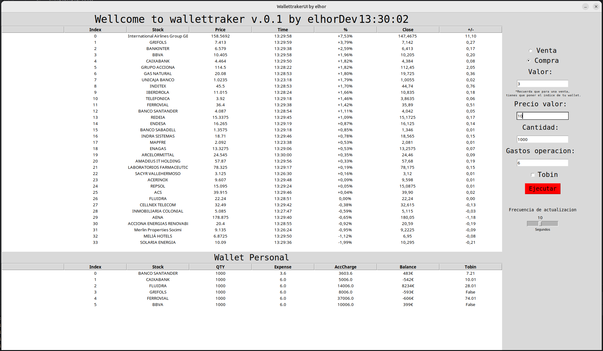
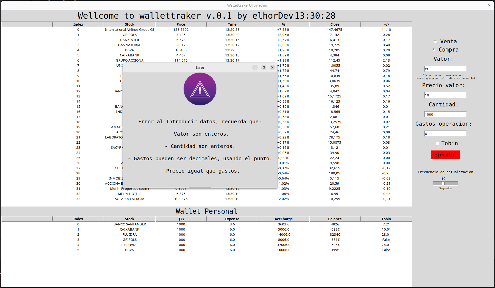

# wallettrakerwithui
## Wallettraker

**Wallettraker** es una aplicación que te permite:

* **Visualizar el IBEX a tiempo real** en una tabla generada a partir de un DataFrame de Pandas.
* **Asignar compras** a diferentes categorías para ver su variación a tiempo real.

**Tecnologías:**

* **Python**
* **Librerías:**
    * Requests
    * Pandas
    * Tkinter
    * BeautifulSoup4
    * Time
    * CSV Manager

**Requisitos:**

* Tener las librerías instaladas con pip:

```
pip install requests pandas tkinter beautifulsoup4 time csv-manager
```

**Uso:**

1. **Ejecuta el archivo `wallettraker.py`.**
2. **La aplicación se abrirá y mostrará una tabla con el IBEX a tiempo real.**
3. **Puedes asignar compras a diferentes Stocks despues de seleccionar las opciones y haciendo clic en el botón "Ejecutar".**
4. **La aplicación calculará la variación de la compra a tiempo real.**

**Contribución:**

Este es un proyecto de código abierto (OSP) sin ánimo de lucro. Puedes contribuir al proyecto de las siguientes maneras:

* **Informando de errores.**
* **Enviando solicitudes de extracción.**
* **Ayudando a mejorar la documentación.**

**Enlaces:**

* **Repositorio:** 

**Licencia:**

Este proyecto no tiene licencia.

**Nota:**

Este proyecto es solo para fines de práctica y formación.



